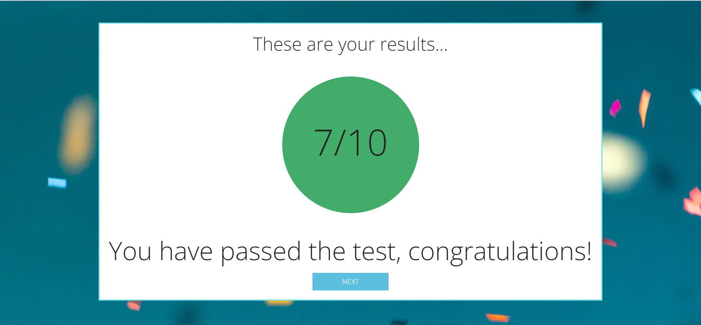

# Proyect Quiz

 <h1 align="center">Quiz❗</h1>

  

    <a href="https://github.com/AdrianRgGit/quiz"><strong>GitHub »</strong></a>
     
  

<!-- TABLE OF CONTENTS -->

  
Índice

  <ol>
        <li><a href="#Objetives">Objetives 🎯</a></li>
    <li>
      <a href="#About-the-project">About the project</a>
      <ul>
      </ul>   
    </li>
    <li>
      <a href="#Resources-used">Resources used</a>
      <ul>
      </ul>
    </li>
    <li><a href="#Web-preview">Web preview</a></li>
    <li><a href="#To-be-done">To be done</a></li>
    <li><a href="#Contact">Contact</a></li>
  </ol>

<!-- ABOUT THE OBJECTIVES -->

## Objetives 🎯

### Quiz features:

<objectives>
  <ol>
    <li>Axios implementation</a></li>
    <li>User register</li>
    <li>Use of local storage</li>
    <li>Users preview</a></li>
</ol>
</objectives>

<!-- ABOUT THE PROJECT -->

## Sobre el proyecto ✏️

Hello everyone, I present to you the Quiz! This project consists of a mini-game where we will answer 10 questions about history. The quiz will be like an exam, so we will know our score at the end!

The project has been carried out to learn more about the use of axios and the different apis that exist. If you like the preview, do not hesitate to contact me!

And lest I forget, the site is totally spa-focused. Thank you for your participation and enjoy the Quiz!

(<a href="#readme-top">Volver al inicio</a>)

### Web views ☁️

<views>
  <ol>
    <li>Home</a></li>
    <li>Questions</a></li>
    <li>Results</a></li>
    <li>Restart</a></li>
    <li>Chart</a></li>
  </ol>
</views>

(<a href="#readme-top">Volver al inicio</a>)

### Resources used 🗒️

- JavaScript
- HTML5
- CSS
- Bootstrap
- Axios

(<a href="#readme-top">Volver al inicio</a>)

<!-- PREVIEW -->

## Web preview 📺

- Home page:
  

- Questions page:
  

- Results page:
  
  

- Users page:
  

<!-- TO BE DONE -->

## To be done 💭

<objectives>
  <ol>
    <li>
    Implement a cheese style graph to know the correct and incorrect questions of each user
    </li>
    <li>Improved display of user cards</li>
    <li>A better login</li>
    <li>And many more things I can think of...</a></li>
</ol>
</objectives>

<!-- CONTACT -->

## Contacto 📲

<a href="https://github.com/AdrianRgGit?tab=repositories">Adrián Ramírez</a>

(<a href="#readme-top">Volver al inicio</a>)

---

<!-- MARKDOWN LINKS & IMAGES -->
<!-- https://www.markdownguide.org/basic-syntax/#reference-style-links -->

[linkedin-shield]: https://img.shields.io/badge/-LinkedIn-black.svg?style=for-the-badge&logo=linkedin&colorB=555
[linkedin-url]: https://linkedin.com/in/sergiocano-dev
[product-screenshot]: images/screenshot.png
[Next.js]: https://img.shields.io/badge/next.js-000000?style=for-the-badge&logo=nextdotjs&logoColor=white
[Next-url]: https://nextjs.org/
[React.js]: https://img.shields.io/badge/React-20232A?style=for-the-badge&logo=react&logoColor=61DAFB
[React-url]: https://reactjs.org/
[Vue.js]: https://img.shields.io/badge/Vue.js-35495E?style=for-the-badge&logo=vuedotjs&logoColor=4FC08D
[Vue-url]: https://vuejs.org/
[Angular.io]: https://img.shields.io/badge/Angular-DD0031?style=for-the-badge&logo=angular&logoColor=white
[Angular-url]: https://angular.io/
[JWT]: https://img.shields.io/badge/JWT-black?style=for-the-badge&logo=JSON%20web%20tokens
[JWT-url]: https://jwt.io/
[Vercel]: https://img.shields.io/badge/vercel-%23000000.svg?style=for-the-badge&logo=vercel&logoColor=white
[Vercel-url]: https://vercel.com/
[MongoDB]: https://img.shields.io/badge/MongoDB-%234ea94b.svg?style=for-the-badge&logo=mongodb&logoColor=white
[MongoDB-url]: https://www.mongodb.com/es
[Express.js]: https://img.shields.io/badge/express.js-%23404d59.svg?style=for-the-badge&logo=express&logoColor=%2361DAFB
[Express.js-url]: https://expressjs.com/
[Node.JS]: https://img.shields.io/badge/node.js-6DA55F?style=for-the-badge&logo=node.js&logoColor=white
[Node.JS-url]: https://nodejs.org/en/
[SASS]: https://img.shields.io/badge/SASS-pink?style=for-the-badge&logo=SASS&logoColor=white
[SASS-url]: https://sass-lang.com/
[React]: https://img.shields.io/badge/React-219ebc?style=for-the-badge&logo=React&typoColor=fedcba&logoColor=white
[React-url]: https://es.reactjs.org/
[Postman]: https://img.shields.io/badge/Postman-FF6C37?style=for-the-badge&logo=postman&logoColor=white
[Postman-url]: https://www.postman.com/
